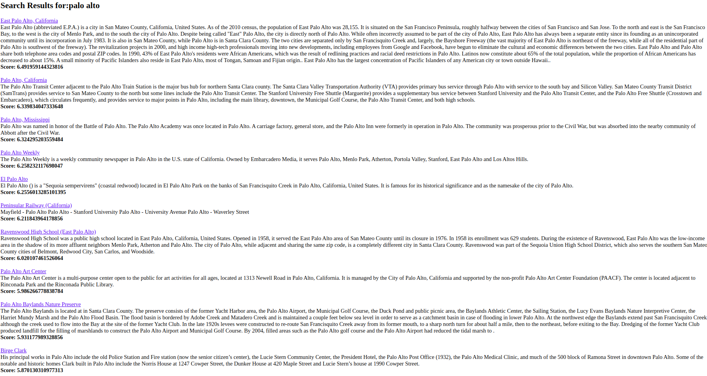
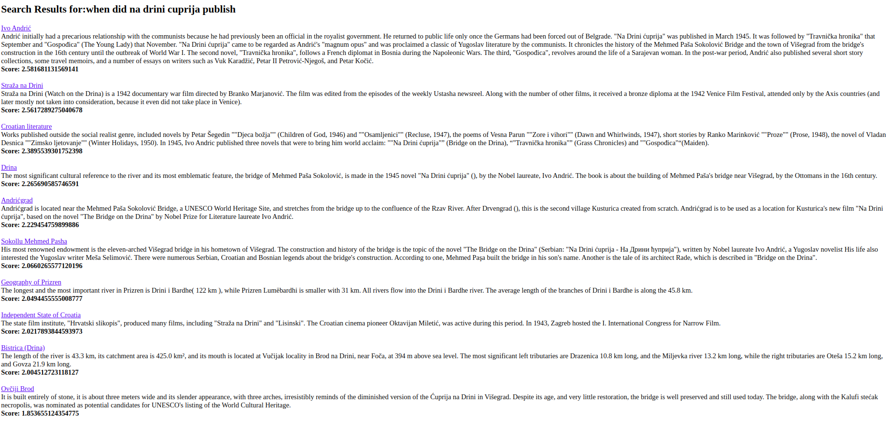
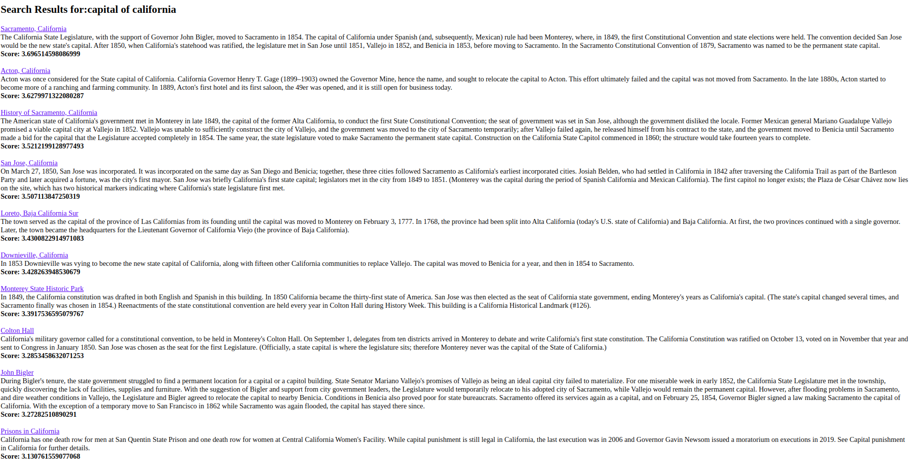
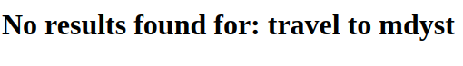

# keyword-and-semantic-search

This repository contains a dockerized API search engine based on keyword match and semantic similarity.
A Wikipedia dump is used as the dataset.

## Requirements
Some of the requirements of the project are:

- Solution should use a local dump of Wikipedia.
- Display Top 10 relevant wikipedia pages, and a relevant snippet for each page.
- Query response latency should not be more than 300ms.

## Architecture
The wikipedia dump uncompressed contains 20468258 articles and is ~60 GB in size. 
In order to make the search algorithm accurate and less time consuming, it consists of a sequence of 2 steps:

1) Keyword Based Retrieval: Retrieve top 10 pages based on keyword match
2) Semantic Retrieval: Apply semantic similarity to retrieve the most relevant sentence in each page as the snippet.

Step 1) is achieved using [Anserini](https://github.com/castorini/anserini) - an IR toolkit based on Apache Lucene.
Anserini's Python Interface [Pyserini](https://github.com/castorini/pyserini) is used here.

Step 2) is achieved using Universal Sentence Encoder (USE) - a sentence encoder model used
to compute semantic sentence similarity.

This approach is based on the solution present in [this paper](https://arxiv.org/pdf/1902.01718.pdf).
In order to make the semantic computation quicker, each paragraph of a page
is indexed as a separate document in the inverted index. 
The average paragraph size of the pages is around 150.
Thus k = 2000 paragraphs are retrieved from the index to ensure that atleast 10 pages are retrieved. 
Anserini retrieves indexed documents based on the BM25 algorithm, whose scoring 
is a variation of the TF-IDF algorithm.

The top k retrieved paragraphs are filtered to obtain the top 10 pages with the highest scored
paragraphs. Two paragraphs are considered for each page. The embeddings of the query, and each paragraph are obtained using the USE model. 
The USE model is used here, as it works well with individual words, sentences and short paragraphs [[Source](https://www.tensorflow.org/hub/tutorials/semantic_similarity_with_tf_hub_universal_encoder)].
Splitting each paragraph into invididual sentences and then retrieving the embeddings resulted in a significant increase in latency ( > 10 seconds).
The [Universal Sentence Encoder-Lite](https://tfhub.dev/google/universal-sentence-encoder-lite/2) model is used here for latency purposes.

The semantic similarities are computed using the dot product between the query and the different sentences.
This score is added to the BM25 score, and constitutes the relevancy (conviction) score.

### User Interface
The User Interface consists of two screens:
- One screen with a simple text box to enter a query and search. The query size is limited to 256 characters
- One screen to display the results of the search.
- One screen to display a no results found if a term is not present in the index.

## Deployment Instructions
1. Download this repository. Ensure Python3 is installed.

2. Download the latest wikipedia dump from [Wikimedia dumps](http://dumps.wikimedia.org/).
This solution is tested on [enwiki-20200801](https://dumps.wikimedia.org/enwiki/20200801/enwiki-20200801-pages-articles-multistream.xml.bz2).

3. Install the following dependencies for building the index:
`pip install wikiextractor pyserini==0.9.4.0`

4. Run this command to extract text from the wikipedia dump:
`python -m wikiextractor.WikiExtractor <path-to-wiki-dump> --json
--no_templates -o <output-directory> -q`. This creates multiple directories
of files, with each file containing a wikipedia page's content as a jsonl object.
Each file contains about 35-40 jsonl objects. Refer the [WikiExtractor Repo](https://github.com/attardi/wikiextractor)
for more info on usage.

5. The Anserini library expects indexable documents as a json object in the form:

    {"id": an_id,
     "contents" : doc text}.
     
     Run the following script in the [scripts](scripts) folder.
      
     `python construct_index_input.py -- data_dir <output-directory-of-wikiextractor> --out_dir <output-path-to-index-input>`
 
6. Construct the index using:

    `python -m pyserini.index -collection JsonCollection -generator DefaultLuceneDocumentGenerator \
 -threads 1 -input <output-path-to-index-input> \
 -index <path-to-index> -storePositions -storeDocvectors -storeRaw`.
 Steps 4-6 take around 4-5 hours on a 64 GB machine.

7. Build the docker image: `sudo docker build -t <image-name> .`

8. Deploy the docker image using: 

`sudo docker run --rm -it -d -v <absolute-path-to-index>:/home/project/indices -p 80:80 <image-name>`.

Since the index directory is about 24 GB in size, it is attached as a volume using the -v option.

## Demo
The service is deployed in http://34.94.231.43/ .
This machine contains 2 CPUs with 64GB Memory. A machine with
such high memory is needed as 8 GB and 16 GB machines yield poor latency ( > 1 minute)

## Examples

1. Query: palo alto

2. Query: when did na drini cuprija publish

3. Query: capital of california

4. Query: Travel to mdyst

## Challenges Faced and Future Directions
The approach described [the reference paper](https://arxiv.org/pdf/1902.01718.pdf) works well for Open Book QA domain problems, where it makes
sense to filter the large search space initially based on keyword match.
However, such a solution may not be ideal for a search engine service, 
as search engines typically require both keyword based retrieval and semantic matching
to be performed together. Consequently, the following concepts may yield better results.

- Knowledge Graphs: Creating a knowledge ontology enables better semantic search
as evidenced in search engines like Google, DuckDuckGo etc, where semantic query expansion works wonders.
The challenge is creating such graphs from datasets like Wikipedia.
I plan on investigating this approach next.

- Snippet Retrieval: Popular search engines use multiple sources like meta tags, article content, and 
their custom knowledge graphs for snippet retrieval. 
A thorough strategy to determine the weights (contributions) of these various sources 
for snippet creation / retrieval is needed.

- Conviction Score: A better methodology is needed in formulating the 
conviction score calculation. This can be done by creating a dataset
of queries, documents, and the snippet to be extracted (if present) from
the document. A model can be trained to learn the relative weights of
keyword retrieval, and semantic based retrieval.
